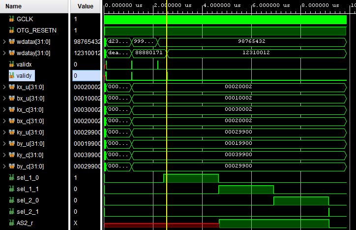

# AD9777_with_mult
The AD9777 is the 16-bit member of the AD977x pin
compatible, high performance, programmable 2×/4×/8×
interpolating TxDAC+ family. The AD977x family features a
serial port interface (SPI) that provides a high level of
programmability, thus allowing for enhanced system level
options.

Datasheet: [AD9777](https://www.farnell.com/datasheets/2253179.pdf)
### Algorithm
Recive coefficients k and b. Then convert wdata 2 times by using formula y = kx + b.  
Output multiplication connected to fifo and spi module AD9777.